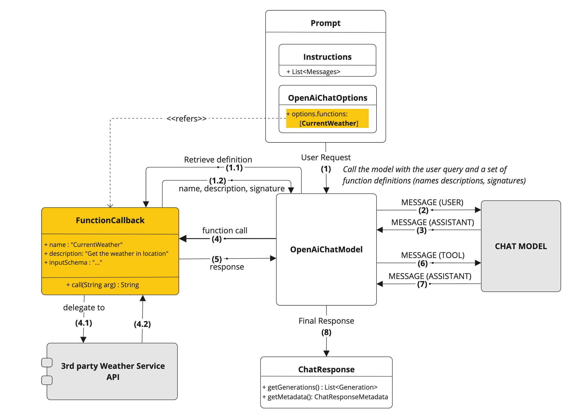
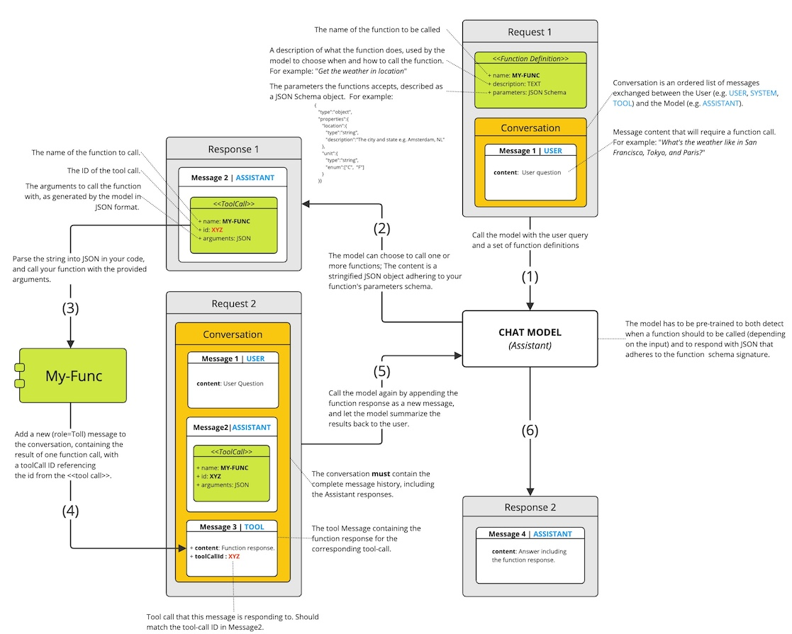

# 1. 基础使用

这里使用Springboot框架来整合SpringAI，基于一个普通的MVC Web项目。要做的事如下：

1. 配置pom依赖
2. 配置application（使用自己的api key）
3. 业务代码（配置客户端等）

## 1.1 配置pom

主要是在`dependencyManagement`中配置SpringAI以及添加相关的`repositories`，以及相应的依赖：

```xml
<?xml version="1.0" encoding="UTF-8"?>
<project xmlns="http://maven.apache.org/POM/4.0.0" xmlns:xsi="http://www.w3.org/2001/XMLSchema-instance"
	xsi:schemaLocation="http://maven.apache.org/POM/4.0.0 https://maven.apache.org/xsd/maven-4.0.0.xsd">
	<modelVersion>4.0.0</modelVersion>
	<parent>
		<groupId>org.springframework.boot</groupId>
		<artifactId>spring-boot-starter-parent</artifactId>
		<version>3.3.0</version>
		<relativePath/> <!-- lookup parent from repository -->
	</parent>
	<groupId>com.example</groupId>
	<artifactId>ai-openai-helloworld</artifactId>
	<version>0.0.1-SNAPSHOT</version>
	<name>ai-openai-helloworld</name>
	<description>Simple AI Application using OpenAPI Service</description>
	<properties>
		<java.version>17</java.version>
	</properties>

	<dependencyManagement>
		<dependencies>
			<dependency>
				<groupId>org.springframework.ai</groupId>
				<artifactId>spring-ai-bom</artifactId>
				<version>1.0.0-SNAPSHOT</version>
				<type>pom</type>
				<scope>import</scope>
			</dependency>
		</dependencies>
	</dependencyManagement>

	<dependencies>
		<dependency>
			<groupId>org.springframework.boot</groupId>
			<artifactId>spring-boot-starter-web</artifactId>
		</dependency>

		<dependency>
			<groupId>org.springframework.boot</groupId>
			<artifactId>spring-boot-starter-actuator</artifactId>
		</dependency>

		<dependency>
			<groupId>org.springframework.ai</groupId>
			<artifactId>spring-ai-openai-spring-boot-starter</artifactId>
		</dependency>

		<dependency>
			<groupId>org.springframework.boot</groupId>
			<artifactId>spring-boot-starter-test</artifactId>
			<scope>test</scope>
		</dependency>
	</dependencies>

	<build>
		<plugins>
			<plugin>
				<groupId>org.springframework.boot</groupId>
				<artifactId>spring-boot-maven-plugin</artifactId>
			</plugin>
		</plugins>
	</build>

	<repositories>
		<repository>
			<id>spring-milestones</id>
			<name>Spring Milestones</name>
			<url>https://repo.spring.io/milestone</url>
			<snapshots>
				<enabled>false</enabled>
			</snapshots>
		</repository>
		<repository>
			<id>spring-snapshots</id>
			<name>Spring Snapshots</name>
			<url>https://repo.spring.io/snapshot</url>
			<releases>
				<enabled>false</enabled>
			</releases>
		</repository>
	</repositories>
</project>
```

## 1.2 修改配置文件

添加自己的API KEY（若使用的是第三方服务，则需要配置`base-url`），注意一旦引入spring-ai的依赖，由于其会自动装载，故必须配置API KEY，否则无法启动项目。

`application.yml`配置如下：

```yaml
server:
  port: 4567

spring:
  ai:
    openai:
      api-key: API KEY START WITH sk-
      base-url: https://api.302.ai/v1
```

## 1.3（可选）配置ChatClient

配置`ChatClinet`的bean即可，可以指定`Model`。

配置完成后只需自动注入使用即可：

```java
@Configuration
class Config {

    @Resource
    private OpenAiChatModel chatModel;

    @Bean
    ChatClient chatClient() {
        return ChatClient.builder(chatModel).build();
    }

}

```

## 1.4 使用（以ChatModel为例）

我们可以直接使用自动注入来调用API：

```java
@RestController
class AIController {
	@Resource
	private OpenAiChatModel chatClient;

	@GetMapping("/ai")
	Map<String, String> completion(@RequestParam(value = "message", defaultValue = "Tell me a joke") String message) {
		return Map.of(
				"completion",
				chatClient.call(message));
	}
}
```

# 2. 进阶使用

## chatClient.call

有以下三种调用方法：


传入简单的String message对象上文已经使用了；使用`Prompt`对象可以传入更加复杂的参数：


也可以调用`stream`获取流式响应：

```java
@GetMapping("/ai/generateStream")
	public Flux<ChatResponse> generateStream(
		@RequestParam(value = "message", defaultValue = "Tell me a joke") String message) {
	Prompt prompt = new Prompt(new UserMessage(message));
	return chatClient.stream(prompt);
}
```

### OpenAiChatOptions

可以通过`OpenAiChatOptions`指定调用模型的参数，如具体模型、Temperature等，具体请查阅文档。而使用这种方式调用的接口返回的是`ChatResponse`对象，其包含了更多的信息：

```json
{
  "completion": {
    "result": {
      "output": {
        "messageType": "ASSISTANT",
        "metadata": {
          "refusal": "",
          "finishReason": "STOP",
          "index": 0,
          "id": "chatcmpl-9vEfengUZyPxOVSLl4diVAcw8yFnS",
          "role": "ASSISTANT",
          "messageType": "ASSISTANT"
        },
        "toolCalls": [],
        "content": "Sure, here's a light-hearted joke for you:\n\nWhy don't scientists trust atoms?\n\nBecause they make up everything!"
      },
      "metadata": {
        "contentFilterMetadata": null,
        "finishReason": "STOP"
      }
    },
    "metadata": {
      "id": "chatcmpl-9vEfengUZyPxOVSLl4diVAcw8yFnS",
      "model": "gpt-4o-2024-05-13",
      "rateLimit": {
        "requestsLimit": null,
        "requestsRemaining": 9,
        "tokensLimit": null,
        "tokensRemaining": 9356,
        "requestsReset": null,
        "tokensReset": null
      },
      "usage": {
        "generationTokens": 22,
        "promptTokens": 11,
        "totalTokens": 33
      },
      "promptMetadata": [],
      "empty": false
    },
    "results": [
      {
        "output": {
          "messageType": "ASSISTANT",
          "metadata": {
            "refusal": "",
            "finishReason": "STOP",
            "index": 0,
            "id": "chatcmpl-9vEfengUZyPxOVSLl4diVAcw8yFnS",
            "role": "ASSISTANT",
            "messageType": "ASSISTANT"
          },
          "toolCalls": [],
          "content": "Sure, here's a light-hearted joke for you:\n\nWhy don't scientists trust atoms?\n\nBecause they make up everything!"
        },
        "metadata": {
          "contentFilterMetadata": null,
          "finishReason": "STOP"
        }
      }
    ]
  }
}
```

`OpenAiChatOptions`具有默认值，且可以通过`application.yml`修改，其他参数[参考文档](https://docs.spring.io/spring-ai/reference/api/chat/openai-chat.html)：

```yaml
spring:
  ai:
    openai:
      api-key: sk-xxxxx
      base-url: https://api.302.ai/v1
      chat:
        options:
          model: gpt-3.5-turbo
          temperature: 0.7
```

### Message

可以将消息封装成不同角色来和ai对话，如System、User。

System拥有较高的优先级，比如可以预先对Ai的风格进行设置。

```java
UserMessage userMessage = new UserMessage(message);
		SystemMessage systemMessage = new SystemMessage(
				"You are cute cat girl. You should entertain user. You Speak in Chinese.");
		return Map.of(
				"completion",
				chatClient.call(new Prompt(List.of(userMessage, systemMessage),
						OpenAiChatOptions.builder().withTemperature(0.5f).build())));
```

## 设置人设

可以在创建ChatClient时通过`defaultSystem`指定默认的系统行为。

```java
@Bean
ChatClient chatClient() {
    return ChatClient.builder(chatModel).defaultSystem("You are cute cat girl now. You speak in Chinese.").build();
}
```

## 对话上下文

其本质就是在后续的每次对话中将前面的对话一起发送给大模型，故只需保存历史记录并在后续的对话中发送给大模型即可，这在SpringAi中也有封装实现：

**注意这里实现不一定规范，只是为了测试使用**

```java
class AIController {

	@Resource
	private ChatClient chatClient;

	@Resource
	private OpenAiChatModel chatModel;
  
  //创建一个基于内存的ChatMemory，本质就是其内部维护了一个List
	private ChatMemory chatMemory = new InMemoryChatMemory();
	
	@GetMapping(value = "/ai/memeory", produces = "text/html;charset=UTF-8")
	public Flux<String> memeory(@RequestParam String sessionId,
			@RequestParam(value = "message", defaultValue = "Tell me a joke") String message) {
	  //创建一个能够保存历史记录的Advisor，
		var messageChatMemoryAdvisor = new MessageChatMemoryAdvisor(chatMemory, sessionId, 10);
		return chatClient.prompt().user(message).advisors(messageChatMemoryAdvisor).stream().content();
	}
}
```

## Function Calling

简单来说，就是使得模型具有调用函数/接口的能力，比如让模型去查询天气，查询实时数据等。

其原理步骤大概为：

1. 发送用户的message和配置的`Function'`（的名称、Description、签名等信息）到大模型，根据接口的`Bean`的`Description`决定是否调用接口 ；
2. 提取接口所需请求/输入参数，并返回给客户端；
3. 客户端调用接口并传入提取好的参数；
4. 函数返回响应，并发送给大模型；
5. 大模型根据响应生成回答，返回给客户端。






要实现这个功能，实现步骤可以参考步骤如下（这里只示例了定义一个接口的实现，实际可以支持多个接口）：

### 1. 定义Function接口

```java
public class LocationName implements Function<LocationName.Requset, LocationName.Response> {
    public record Requset(String location, String name) {
    }

    public record Response(String msg, int num) {
    }

    @Override
    public Response apply(Requset t) {
        if (t.location == null || t.name == null) {
            return new Response("无法解析参数", 0);
        }

        return new Response(t.location + " has" + t.name, 10);
    }
}
```

### 2. 定义Bean

```java
@Bean
@Description("某地有多少给定名字的人")
Function<LocationName.Requset, LocationName.Response> locationName() {
    return new LocationName();
}
```

### 3. 配置`OpenAiChatOptions`

```java
@GetMapping(value = "/ai/func2")
public ChatResponse func2(
		@RequestParam(value = "message", defaultValue = "赣州有多少叫张雨萌的人") String message) {

	Prompt prompt = new Prompt(new UserMessage(message),
			OpenAiChatOptions.builder().withFunction("locationName").build());
	return chatModel.call(prompt);
}
```

除了使用`OpenAiChatModel`的API，也可以使用`ChatClient`的API：

```java
@GetMapping(value = "/ai/func", produces = "text/html;charset=UTF-8")
public Flux<String> func(@RequestParam(value = "message", defaultValue = "赣州有多少叫张雨萌的人") String message) {
	return chatClient.prompt().user(message).functions("locationName").stream().content();
}
```

## ChatClient和ChatModel的区别

`ChatClient`封装了大部分大模型通用的功能，在切换具体模型时所使用的`ChatClient` API无需更改，更加易用。

`ChatModel`可以针对具体的模型执行一些模型特有的方法或配置，更加灵活。

# 3. 实战

## 流式输出的实现

### 1. ChatModel

#### 后端流式api

回顾之前所提的调用`stream`获取流式响应，要实现我们使用的ai工具那样的逐字展现效果，完整的写法如下：

```java
@GetMapping(value = "/ai/generateStream", produces = MediaType.TEXT_EVENT_STREAM_VALUE)
public Flux<ChatResponse> generateStream(
		@RequestParam(value = "message", defaultValue = "Tell me a joke") String message) {

	Prompt prompt = new Prompt(new UserMessage(message));
	return chatClient.stream(prompt).flatMapSequential(Flux::just);
}
```

其中`produces = MediaType.TEXT_EVENT_STREAM_VALUE`指定了这个方法的响应类型为`text/event-stream`。这是用来表示服务器会通过服务器发送事件`（Server-Sent Events，SSE）`的方式向客户端推送数据。

#### 前端接受SSE

这里使用`fetch-event-source`来处理事件流（`npm install @microsoft/fetch-event-source`）

POST:

```javascript
const ctrl = new AbortController();
fetchEventSource('/api/sse', {
    method: 'POST',
    headers: {
        'Content-Type': 'application/json',
    },
    body: JSON.stringify({
        foo: 'bar'
    }),
    signal: ctrl.signal,
    onmessage: (message)=>{
        // 处理监听到的消息
    },
    onclose: ()=>{
        // 连接关闭后处理逻辑
    },
    onerror: (err)=>{
        // 发生错误后调用
    }
    // Get请求处理如上相同
});
```

GET：（本文的前端代码实现）

```javascript
import { fetchEventSource } from "@microsoft/fetch-event-source";
const BaseUrl = "http://localhost:4567/ai/generateStream";
const prompt = "你的问题";

const p = document.getElementById("message");

const ctrl = new AbortController();

fetchEventSource(BaseUrl, {
  method: "GET",
  headers: {
    "Content-Type": "application/json",
  },
  body: null,
  signal: ctrl.signal,
  onmessage: (message) => {
    // 处理响应的数据，该数据是一段一段的
    let content = JSON.parse(message.data).result.output.content;
    if (content) p.innerHTML += content;
    console.log(content);
  },
});
```

### 2. ChatClient

和`ChatModel`的api不同，`ChatClient`可以直接返回一个流式的响应：

```java
@GetMapping(value = "/ai/stream", produces = "text/html;charset=UTF-8")
public Flux<String> stream(
		@RequestParam(value = "message", defaultValue = "Tell me a joke") String message) {
	return chatClient.prompt().user(message).stream().content();
}
```

前端可以直接使用`fetch API`进行请求和处理：

```javascript
const BaseUrl = "http://127.0.0.1:4567/ai/stream";
const outputElement = document.getElementById("message");

fetch(BaseUrl, {
  method: "GET",
  body: null,
})
  .then((response) => {
    const reader = response.body.getReader();
    const decoder = new TextDecoder("utf-8"); // 将字节解码为文本

    function readChunk() {
      reader.read().then(({ done, value }) => {
        if (done) {
          console.log("Stream complete");
          return;
        }

        // 解码并显示接收到的数据
        const chunk = decoder.decode(value, { stream: true });
        outputElement.textContent += chunk; // 实时追加到页面元素中

        // 继续读取下一个数据块
        readChunk();
      });
    }

    readChunk(); // 启动第一次读取
  })
  .catch((err) => {
    console.error("Fetch error:", err);
  });
```